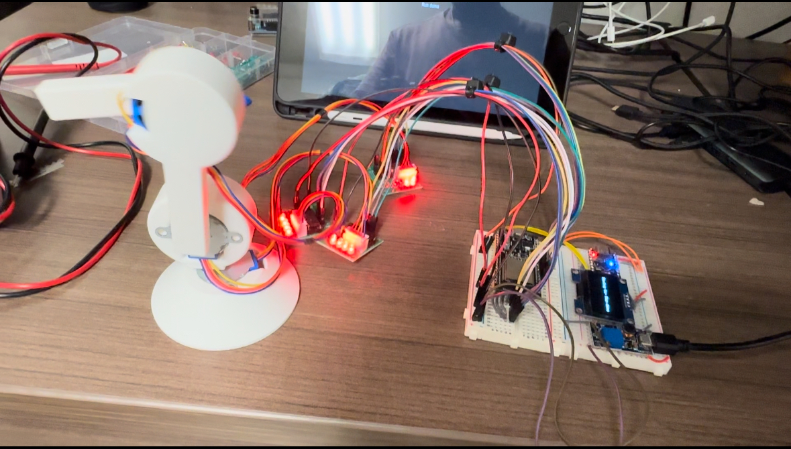
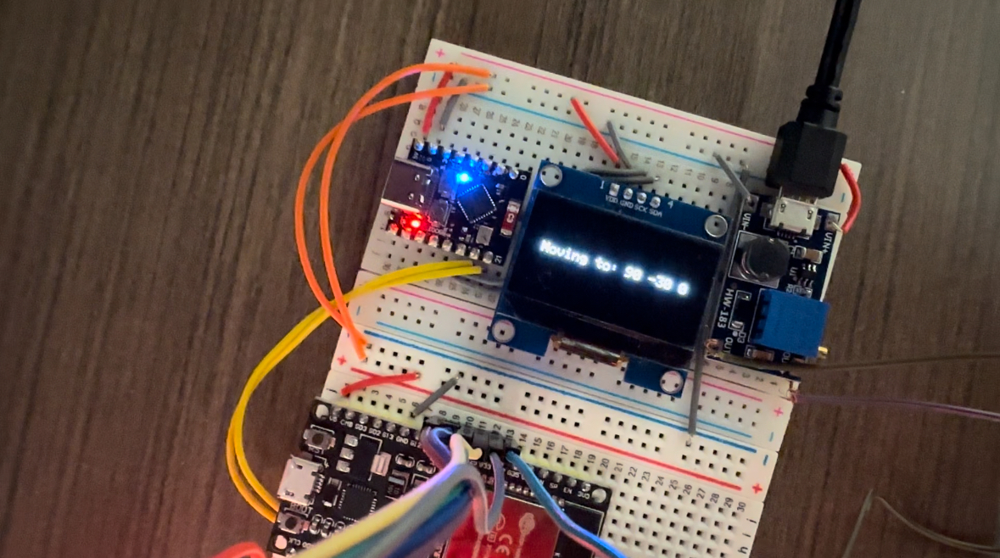

# ESP32-IoT-Robot

3-Axis Robot Arm with Wireless Control
This project showcases a 3-axis robotic arm controlled by ESP32 microcontrollers with real-time wireless control via a web interface. Designed for precision and ease of use, this system integrates motor control, UART communication, and Wi-Fi connectivity to deliver a seamless user experience.

Features
Precise Motor Control:
Utilizes stepper motors for smooth and accurate multi-axis movements, with configurable speed and acceleration.

Wireless Interface:
Hosts a web server on one ESP32, creating a Wi-Fi access point where users can control the robot by entering commands through a dynamic HTML-based interface.

Real-Time Communication:
Implements UART communication between two ESP32s—one handling the web interface and the other executing motor commands.

User Feedback Display:
Features an OLED screen to provide real-time feedback, such as Wi-Fi access point details and current robot actions.

Modular Firmware Design:
Encapsulates motor control, OLED handling, and web server management into reusable, easy-to-extend modules.

Hardware Used
Microcontrollers: Two ESP32s (one for motor control, one for web interface).
Motors: 28BYJ-48 stepper motors (12V).
Display: OLED screen for system feedback.
Technical Highlights
Programming: C++ firmware with modular design for reusability and scalability.
Communication: UART protocol for reliable data transfer between microcontrollers.
Web Server: Custom web page served directly from the ESP32 for user input.
OLED Integration: Displays Wi-Fi details and system status using I2C communication.
How It Works
Wi-Fi Setup: The first ESP32 creates a Wi-Fi access point and hosts a web server for user input.
Command Transmission: Input data is sent to the second ESP32 via UART, which processes and executes motor movements.
Feedback: The OLED screen displays real-time system information, such as received commands and connection status.
